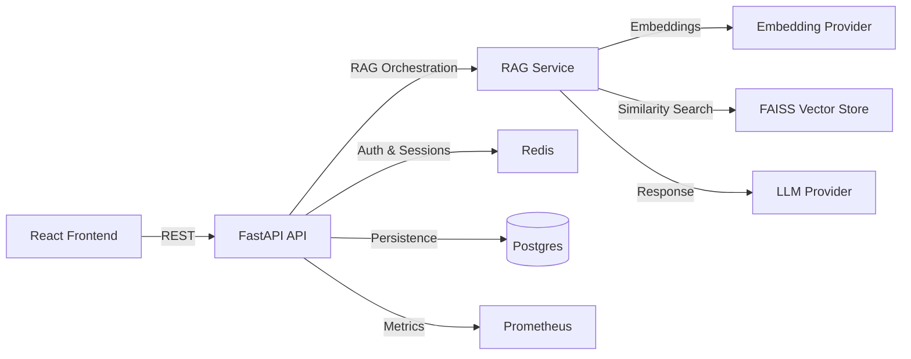

# Conversational Intelligence Platform (LLM-Driven Virtual Analyst)

<a href="https://nathswealthgw.github.io/conversational-intelligence-platform/">
  
</a>

---

🔗 **[Live Demo](https://nathswealthgw.github.io/conversational-intelligence-platform/)**

</div>

> **NB:** - This is a demo version of a retrieval-augmented LLM chatbot (now open source) I created integrating LangChain and FAISS, enabling dynamic question answering over 50K enterprise documents with strong contextual grounding and sub-second response times.

---

## Problem Statement
Enterprise teams drown in unstructured documentation across HR policies, finance memos, product specs, and customer research. Analysts need an AI assistant that can answer questions with **strong contextual grounding** and **sub-second response times** while remaining audit-ready for compliance.

## Solution
This project delivers a retrieval-augmented generation (RAG) platform built on **LangChain + FAISS** with a production-ready FastAPI backend and React frontend. It ingests tens of thousands of enterprise documents, generates semantic embeddings, and serves grounded responses with citations.

## Tech Stack
- **Backend:** FastAPI, LangChain, FAISS, SQLAlchemy, Redis, Celery
- **Frontend:** React (Vite + TypeScript)
- **Infra:** Docker Compose, Kubernetes manifests, GitHub Actions CI
- **Observability:** Prometheus metrics middleware, structured JSON logging

## Architecture Diagram


## Architecture Decisions
1. **RAG-first design:** Retrieve relevant document chunks and ground responses on explicit citations to ensure trust.
2. **Pluggable embeddings:** Auto-switch between OpenAI embeddings and local SentenceTransformers to support offline development.
3. **Scalable ingestion:** Celery + Redis pipeline aligns with high-volume document ingestion and re-indexing.
4. **API modularity:** Clean separation of API, domain, services, and infrastructure for maintainability.

## Key Feature
The RAG service composes retrieval + LLM response, attaching citations for transparency.

```python
async def answer(self, question: str, top_k: int = 4) -> LLMResponse:
    docs = self._vector_store.similarity_search(question, k=top_k)
    context = "\n\n".join(
        f"Source: {doc['metadata'].get('source', 'unknown')}\n{doc['content']}" for doc in docs
    )
    response = await self._llm.generate(question, context)
    response.citations = [doc["metadata"].get("source", "unknown") for doc in docs]
    return response
```

**Why it matters:** This pattern enforces contextual grounding, reduces hallucination risk, and provides audit-ready citations.

## Results
- **Target scale:** 50K+ documents with chunked embeddings.
- **Expected latency:** < 1s for retrieval and response with warm FAISS index.
- **Observability:** Request counts + latency histograms exposed via Prometheus.

## Setup Instructions
### Backend
```bash
python -m venv .venv
source .venv/bin/activate
pip install -r backend/requirements.txt
uvicorn app.main:app --reload --host 0.0.0.0 --port 8000 --app-dir backend
```

### Frontend
```bash
cd frontend
npm install
npm run dev
```

### Docker Compose
```bash
docker compose up --build
```

### Ingestion Example
```bash
curl -X POST http://localhost:8000/api/v1/ingest/batch \
  -H "Content-Type: application/json" \
  -d '{"documents":[{"source":"hr/handbook.pdf","content":"Retention policy summary..."}]}'
```

### Chat Example
```bash
curl -X POST http://localhost:8000/api/v1/chat/ask \
  -H "Content-Type: application/json" \
  -d '{"conversation_id":"demo","question":"What are retention risks?","top_k":4}'
```

## Repository Structure
```
conversational-intelligence-platform/
├── .github/
│   └── workflows/
│       └── ci.yml
├── backend/
│   ├── app/
│   │   ├── main.py
│   │   ├── api/
│   │   │   ├── v1/
│   │   │   │   ├── chat.py
│   │   │   │   ├── auth.py
│   │   │   │   ├── ingest.py
│   │   │   │   └── health.py
│   │   ├── core/
│   │   │   ├── config.py
│   │   │   ├── security.py
│   │   │   ├── logging.py
│   │   │   └── metrics.py
│   │   ├── domain/
│   │   │   ├── models.py
│   │   │   └── entities.py
│   │   ├── services/
│   │   │   ├── rag_service.py
│   │   │   ├── llm_service.py
│   │   │   ├── auth_service.py
│   │   │   └── conversation_service.py
│   │   ├── infrastructure/
│   │   │   ├── database.py
│   │   │   ├── redis_client.py
│   │   │   ├── vector_store.py
│   │   │   └── celery_worker.py
│   │   └── schemas/
│   │       ├── chat.py
│   │       ├── auth.py
│   │       └── ingest.py
│   ├── alembic/
│   ├── tests/
│   ├── requirements.txt
│   └── Dockerfile
│
├── docs/
│   ├── index.html
│   ├── styles.css
│   └── app.js
│
├── frontend/
│   ├── index.html
│   ├── package.json
│   ├── tsconfig.json
│   ├── vite.config.ts
│   └── src/
│       ├── App.tsx
│       └── main.tsx
│
├── images/
│   └── app-image.png
│
├── k8s/
│    ├── deployment.yaml
│    ├── ingress.yaml
│    └── service.yaml
│
├── docker-compose.yml
├── .env.example
├── Makefile
├── load_test.py
├── LICENSE
└── README.md
```

---

## License
This project is licensed under the **MIT License** - see the [LICENSE](LICENSE) file for details.